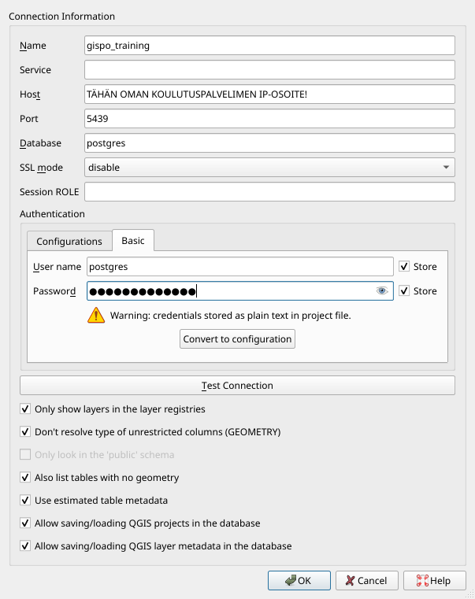

# Harjoitus 3: Aineistojen lataaminen


|     |       |
|:--: | :---: |
| <span style="color:purple"> **Harjoituksen sisältö** </span> | Harjoituksessa ladataan paikkatietoaineistoja PostGIS-tietokantaan. |
| <span style="color:purple"> **Harjoituksen tavoite** </span> | Harjoituksen jälkeen opiskelijalla on perustiedot paikkatietoaineistojen lataamiseen paikkatietokantaan. |

### Valmistautuminen

Alusta notebook SQL-harjoituksia varten ([SQL-solujen ohje](Harjoitus%201.ipynb#SQL-solujen-ajaminen)). Kannattaa muutenkin pitää [ohje](Harjoitus%201.ipynb) mielessä, sillä sieltä voi tarkistaa esimerkiksi miten notebook-solu ajetaan.

Myös QGIS tulee olla asennettuna, jotta paikkatietoaineistoja voidaan ladata.


```python
%load_ext sql
from ipygis import get_connection_url

c_url = get_connection_url(dbname="trainingdatabase")
%sql $c_url
```

## Harjoitus 3.1: Tekstitiedoston lataaminen

Monia pistemäisiä paikkatietoaineistoja on tallennettu CSV-tiedostoihin, jossa ne eivät varsinaisesti ole paikkatietomuodossa. Ensimmäisessä harjoituksessa ladataan globaali lentokenttiä kuvaava aineisto PostgreSQL-tietokantaan.  Luodaan ensin harjoitustietokantaan taulu seuraavasti:


```python
%%sql
DROP TABLE IF EXISTS airports;

CREATE TABLE airports
(
    id            integer,
    name          text,
    city          text,
    country       text,
    IATA_code     char(3),
    ICAO_code     char(4),
    latitude      numeric,
    longitude     numeric,
    altitude      numeric,
    timezone      text,
    dst           text,
    tz_zone       text,
    type          text,
    source        text
);
```

Kyseinen aineisto on ladattu valmiiksi [OpenFlights.org-sivustolta](http://openflights.org/data.html) päänäkymän data-kansioon.

 > Tarkastele miltä kyseinen aineisto näyttää kansiossa.

Voit lukea CSV-tiedoston tiedot edellisessä vaiheessa luotuun tauluun seuravaalla komennolla:


```python
%%sql
COPY airports
FROM '/home/oppilas/Harjoitukset/data/airports.dat'
WITH CSV;
```

**COPY**-komento viittaa tiedostoon kovalevyllä ja lataa sen. **COPY** voi viitata CSV:n lisäksi myös esimerkiksi [binääriformaatteihin tai tekstitiedostoihin.](https://www.postgresql.org/docs/11/sql-copy.html)

> Tarkista lopuksi, että tietokantataulussa on dataa.


```python
%%sql
SELECT *
FROM airports
LIMIT 10;
```

> Aineistoa tarkastelemalla nähdään, että taulussa on koordinaatteja, mutta ne on tallennettu vain numeroarvoina; ei paikkatietotyyppinä.

Jotta PostGIS:n toiminnallisuuksia voisi hyödyntää aineiston kanssa, tulee kyseiseen tauluun lisätä geometriasarake. PostGIS:ssä on valmis [funktio](https://postgis.net/docs/AddGeometryColumn.html) tähän tarkoitukseen. Tarkastele dokumentaatiosta miten kyseistä funktiota käytetään. 


```python
%%sql
SELECT AddGeometryColumn ('airports','geom',4326,'POINT',2);
```

Tarkastele taulua uudelleen.


```python
%%sql
SELECT *
FROM airports
LIMIT 10;
```

Tauluun on ilmestynyt uusi sarake. Sarake ei kuitenkaan sisällä vielä mitään tietoa. Päivitetään taulun sisältö **UPDATE**-komennon avulla.

> Seuraavassa komennossa on ketjutettu useampi funktio sisäkkäin.
> - [ST_MakePoint](https://postgis.net/docs/ST_MakePoint.html) luo tekstikenttien perusteella pistemuotoisen geometrian
> - [ST_SetSRID](https://postgis.net/docs/ST_SetSRID.html) asettaa kyseiselle tietokentälle EPSG-koodin avulla koordinaattijärjestelmän


```python
%%sql
UPDATE airports
SET geom = ST_SetSRID(ST_MakePoint(longitude, latitude),4326);
```

> Tarkastele lopuksi aineistoa esimerkiksi pgAdminin karttatoiminnallisuuden avulla. 

## Harjoitus 3.2: Paikkatietoaineiston lataaminen

Maanmittauslaitoksen aineisto on ladattu valmiiksi päänäkymän [data-kansioon](http://localhost/tree/data).

### Vaihtoehto 1: QGISin tietokannan hallinnan avulla
QGIS-työpöytäohjelmisto tarjoaa erittäin kätevän graafisen käyttöliittymän paikkatietoaineistojen lataamiseksi PostGIS-tietokantaan. Useat QGISin eri työkalut mahdollistavat joustavan latauksen ja mahdolliset muokkaukset aineistoon jo ennen latausta. 

Ensimmäisessä vaiheessa otetaan yhteys lokaalista QGIS-asennuksesta koulutuksessa käytettävään PostGIS-tietokantaan. Avaa tässä vaiheessa QGIS, jos et ole sitä jo tehnyt. Lisää uusi tietokantayhteys avaamalla QGISin tietolähteiden hallinta klikkaamalla Tasot > Tietolähteiden hallinta. Valitse Tietolähteiden hallinta -ikkunasta PostgreSQL-välilehti ja klikkaa Uusi-painiketta.

Syötä Yhteyden tiedot -ikkunaan seuraavat tiedot tietokantayhteyden määrittämiseksi:




Huomaa, että Name-kenttä kuvaa vain QGISiin tallennettavan yhteyden nimeä eikä itse tietokannan nimeä. Yhteyden valinnaisista toiminnallisuuksista kannattaa oletuksena valita kaikki. Esimerkiksi arvioidun metadatan käyttäminen nopeuttaa hakuja huomattavasti.

Paina **Testaa yhteyttä** -painiketta varmistaaksesi tietokantayhteyden toiminnan ja paina **OK**. QGISin sisällä voi myös ajaa SQL-komentoja esimerkiksi **DB Manager**in avulla.

Ota yhteys QGISista postgres-nimisen tietokannan lisäksi trainingdatabase-nimiseen tietokantaan, jossa tulemme operoimaan loppukurssin ajan. Tietokantayhteyden muodostaminen tapahtuu hyvin pitkälti samoin kuin yllä on kuvattu. Ainoastaan Name-kohtaan tulee syöttää jokin muu arvo (esim. gispo_trainingdatabase).

Luo tässä vaiheessa harjoitustietokantaan uusi skeema, jonne Maanmittauslaitoksen aineistot tullaan lataamaan, ja anna skeemalle nimeksi “nlsfi”. Skeemojen avulla on helpompi pitää aineistot järjestyksessä. Uuden skeeman voi luoda pgAdminin graafisen käyttöliittymän kautta, QGISin kautta tai seuraavalla SQL-komennolla:


```python
%%sql
CREATE SCHEMA IF NOT EXISTS nlsfi;
```

> Jos et saa luomaasi skeemaa näkyviin QGISin puolella, koita ajaa ao. solut ja käynnistää QGIS-projekti uudelleen.


```python
%%sql
DROP TABLE IF EXISTS nlsfi.example;

CREATE TABLE nlsfi.example
(
    id            integer,
    name          text
);
```


```python
%%sql
INSERT INTO nlsfi.example
VALUES (1, 'testi');
```

Lataa päänäkymän [data-kansio](http://localhost/tree/data) omalle koneellesi. Lisää TieViiva.shp-aineisto tyhjään QGIS-projektiin. Aineiston voi lisätä navigoimalla Tasot > Lisää taso > Lisää vektoritaso, klikkaamalla Lisää vektoritaso -kuvaketta tasojen hallinnan työkalupalkista tai ihan vain raahaamalla tasoja suoraan Selain-ikkunasta Tasot-ikkunaan.
> Tarkista, että Koodaus-kohdassa on valittu UTF-8. Mikäli aineisto koodataan jollakin toisella järjestelmällä, ääkköset puuttuvat metatiedoista.

QGIS-projektiin avautuu vektoriaineisto, johon on määritelty tietty koordinaattijärjestelmä. Tarkista, että koordinaattijärjestelmäksi on määritelty ETRS89 / TM35FIN(E,N) (EPSG: 3067) tai EPSG:3047. Tason koordinaattijärjestelmän voit tarkistaa ja muuttaa klikkaamalla hiiren oikeaa painiketta TieViiva-tasolla ja valitsemalla **Ominaisuudet > Lähde > Aseta koordinaattijärjestelmä**.


Lataa projektiisi ja tietokantaasi (ainakin) seuraavat aineistot:
- TieViiva
- HallintoAlue
- KarttanimiPiste1000
- SahkoLinja
- LentokenttaPiste
- RautatieViiva

Avaa QGISin prosessointityökaluista työkalu nimeltä Export to PostgreSQL. Avaa työkalun alapalkista **Run as Batch Process**, joka mahdollistaa useamman taulun ajamiseen tietokantaan kerralla. Muuta parametreja niin, että aineistot tulee ladattua oikeaan skeemaan ja tietokantaan. **Fill Down** -toimintoa käyttämällä sinun ei tarvitse klikkailla jokaisen tason kohdalta arvoja kuntoon. Lisää geometriasarakkeen nimeksi "wkb_geometry" ja, varmistaaksesi taulujen nimien kirjaantumisen pienillä kirjaimilla, avaa taulun nimen määrittävässä kohdassa lausekkeenmuodostaja ja kopioi siihen komento:

```
lower(layer_property( @INPUT, 'name'))
```

Tarkista mitä muita parametrejä prosessi pitää sisällään. Voit kuitenkin jättää ne oletusarvoisiksi. Lopulta latausprosessisi pitäisi näyttää kutakuinkin tältä. Klikkaa **Run**!


> Tarkista latauksen jälkeen, että aineistot ovat latautuneet. Tarkista virheilmoitukset ja korjaa latausta tarvittaessa.


```python
%%sql
SELECT *
FROM nlsfi.tieviiva
LIMIT 10;
```

### Vaihtoehto 2: Komentorivin avulla

Komentoriviltä tapahtuvaan lataamiseen käytetään **shp2pgsql**-ohjelmaa tai **ogr2ogr**-työkalua. Käynnistämällä ohjelman ilman parametrejä saat opasteen eri parametreistä. Tämän jälkeen voit ladata aineistoa äsken luotuun skeemaan **ogr2ogr**-työkalulla. Jos koneellasi on asennettu OSGeo4W-paketti (tulee QGIS:n asennuksen mukana), avaa käynnistysvalikosta **OSGeo4W Shell** ja anna seuraava komento:

```sh
ogr2ogr -f “PostgreSQL” PG:”host=<hostname>  dbname=<dbname> user=<kayttaja> password=<salasana>” <dir>\tiedostonimi.shp -lco SCHEMA=nlsfi
```

> Muista tarkistaa, että aineiston hakemistopolku ja muut parametrit ovat kunnossa!

**ogr2ogr**-komennon käyttämät parametrit ovat:

```
-f   output file format name
-lco layer creation option
```

Muita parametreja voit tutkia suorittamalla **ogr2ogr**-komennon ilman parametrejä. PostGIS-asennuksen yhteydessä usein asennettavalla **shp2pgsql**-työkalulla on myös mahdollista luoda shp-tiedostoista SQL-muotoisia lataustiedostoja. Komentorivityökalut mahdollistavat useamman tiedoston lataamisen tietokantaan kätevästi yhdellä kertaa. Esimerkiksi Windows-ympäristössä on mahdollista ladata kansiollisen gml-tiedostoja kerralla tietokantaan seuraavalla komennolla:

```sh
for %i in (*.gml) do ogr2ogr -update -append -f PostgreSQL PG:"host=<hostname> port=5432 dbname=<tietokantanimi> user=<kayttaja> password=<salasana> schemas=gml" %i
```

Siirry takaisin [päänäkymään](/tree).

<a rel="license" href="http://creativecommons.org/licenses/by-nd/4.0/">
