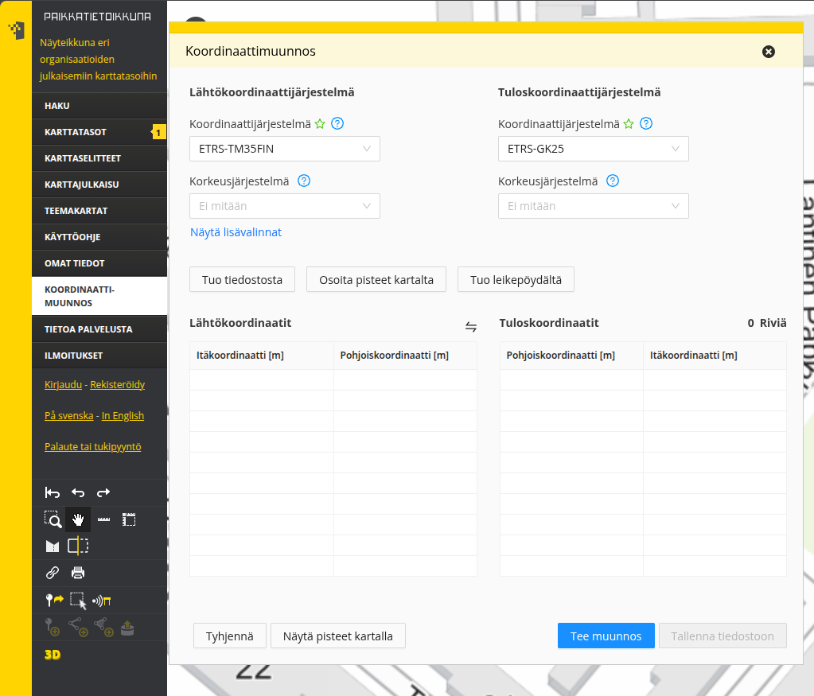
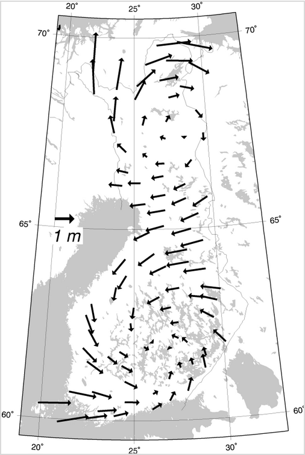

# Harjoitus 7: Koordinaattijärjestelmät

**Harjoituksen sisältö** - Harjoituksessa tutustutaan PostGISin tapaan käsitellä koordinaattijärjestelmiä ja karttaprojektioita.

**Harjoituksen tavoite** - Harjoitusten jälkeen opiskelijalla on perustiedot PostGISin koordinaattijärjestelmien ja karttaprojektion käytöstä.

### Valmistautuminen

Avaa [pgAdmin](/pgadmin) selaimeen ja kirjaudu sisään.  Avaa **Query Tool** (Valitse _trainingdatabase_ **->** Ylhäältä **Tools** **->** **Query Tool**). Käytössä tulee olla myös web-selain, joka mahdollistaa pääsyn Maanmittauslaitoksen koordinaattien muunnospalveluun.

### Käytettäviä funktioita

Tässä harjoituksessa koordinaattien konversioihin ja muunnoksiin voidaan käyttää mm. seuraavia funktioita:

| PostGIS-funktio | Toiminta |
|:--: | :---: |
| ST_GeomFromText(text WKT, integer srid) | Palauttaa ST_Geometry-olion WKT-muotoisesta esitystavasta annetulla EPSG:llä |
| ST_AsText(geometry g) | Palauttaa ST_Geometry-olion määrityksen selväkielisessä WKT-muodossa |
| ST_Transform(geometry g1, integer srid) | Palauttaa geometrian muunnettuna parametrina annetun EPSG:n mukaiseen koordinaattijärjestelmään |
| ST_Transform(geometry geom, text to_proj) | Palauttaa geometrian muunnettuna parametrina PROJ.4-muodossa annettuun järjestelmään |
| ST_Transform(geometry geom, text from_proj, text to_proj) | Palauttaa geometrian muunnettuna PROJ.4-muodossa annetuista järjestelmistä toiseen |
| ST_Transform(geometry geom, text from_proj, integer to_srid) | Palauttaa geometrian muunnettuna PROJ.4-muodossa annetusta järjestelmästä annetun EPSG:n mukaiseen koordinaattijärjestelmään |

## Harjoitus 7.1: Koordinaattipisteen konversio

Muodosta maantieteellisistä ETRS89-koordinaateista (EPSG:4258) 24.3953148 (pituusaste) ja 60.2174696 (leveysaste) Kallion kirkkoa vastaava PostGISin koordinaattipiste:

:::code-box
```sql
SELECT
ST_GeomFromText('POINT(24.3953148 60.2174696)', 4258);
```
:::

## Harjoitus 7.2: Koordinaattimuunnos

Tee Kallion kirkon koordinaatteille konversio ETRS-TM35FIN-koordinaattijärjestelmään (EPSG:3067) hyödyntämällä **ST_Transform**-funktiota.

:::code-box
```sql
SELECT
...
```
:::

<button onclick="toggleAnswer(this)" class="btn answer_btn">vinkki</button>

::: hidden-box
:::code-box
```sql
-- täydennä oikeat funktiot vinkkien perusteella.
-- täydennä lähto- ja tavoitekoordinaattijärjestelmät '...'- kohtiin
SELECT
geometria_tekstinä(koordinaattimuunnos(luo_geometria_tekstistä('POINT(24.3953148 60.2174696)', ...), ...));
```
:::
:::

<button onclick="toggleAnswer(this)" class="btn answer_btn">ratkaisu</button>

:::hidden-box
:::code-box
```sql
SELECT
ST_asText(ST_Transform(ST_GeomFromText('POINT(24.3953148 60.2174696)', 4258), 3067));
```
:::
:::

Tuloksena pitäisi tulla seuraavat koordinaattipisteet EPSG:3067-koordinaattijärjestelmässä:

:::code-box
```
0101000020FB0B0000BE87BABAC1B515411865678EF3795941
```
:::
tai selväkielisemmin:

:::code-box
```
POINT(355696.43235218147 6678478.225060724)
```
:::

## Harjoitus 7.3: Koordinaattimuunnosten vertailu

Tee seuraavaksi Kallion kirkon koordinaateille muunnos **KKJ2**-koordinaattijärjestelmään (EPSG:2392).

:::code-box
```sql
SELECT
...
```
:::

<button onclick="toggleAnswer(this)" class="btn answer_btn">vinkki</button>

::: hidden-box
:::code-box
```sql
-- täydennä oikeat funktiot vinkkien perusteella.
-- täydennä lähto- ja tavoitekoordinaattijärjestelmät '...'- kohtiin
SELECT
geometria_tekstinä(koordinaattimuunnos(luo_geometria_tekstistä('POINT(24.3953148 60.2174696)', ...), ...));
```
:::
:::

<button onclick="toggleAnswer(this)" class="btn answer_btn">ratkaisu</button>

:::hidden-box
:::code-box
```sql
SELECT
ST_asText(ST_Transform(ST_GeomFromText('POINT(24.3953148 60.2174696)', 4258), 2392));
```
:::
:::

Tuloksen pitäisi olla:

:::code-box
```
POINT(6678507.76432921 2522091.992364572)
```
:::

Vertaa saatuja koordinaattiarvoja Maanmittauslaitoksen ylläpitämän [koordinaattimuunnospalvelun](https://kartta.paikkatietoikkuna.fi/) koordinaatteihin. Koordinaattimuunnostoiminto löytyy **Paikkatietoikkunan** vasemman reunan valikosta nimellä **Koordinaattimuunnos**.



Huomaa, että EPSG:4258- ja EPSG:3067-koordinaattijärjestelmien välillä tehtiin koordinaattikonversio, eikä PostGIS:n ja MML:n laskennassa ole oleellista eroa.

Tehdään koordinaattimuunnos EPSG:4258- ja EPSG:2392-koordinaattijärjestelmien välillä. Ero PostGISin ja Maanmittauslaitoksen laskemien koordinaattien välillä on merkittävämpi:

| PostGIS | MML | Erotus (m) |
| :--: | :---: | :---: |
| 6,678,  507.764333 | 6,678,  507.677300 | 0.087033 |
| 2,522,  091.992365 | 2,522,  091.368400 | 0.623965 |
\

:::hint-box
Mistä koordinaattimuunnoksen ero voi johtua?
:::

### Koordinaattijärjestelmien määritykset

Koordinaattijärjestelmien kuvaukset löytyvät **spatial_ref_sys**–taulusta:


:::code-box
```sql
SELECT
srid, proj4text
FROM
spatial_ref_sys
WHERE
srid = 2392;
```
:::

Tallennetut muunnosparametrit EUREF-FIN-datumin ja KKJ-datumin välillä antavat maksimissaan kahden metrin virheen Suomen alueella (kuva JHS 197-suosituksesta):



#### Puuttuvia koordinaattijärjestelmiä

EUREF-FIN -pohjaisten koordinaattijärjestelmien käyttöönotossa on EPSG-tietokantaan tuotettu erilaisia versioita ns. GK-koordinaattijärjestelmistä.

## Harjoitus 7.4: Koordinaattijärjestelmien määrittelyt

Tarkista mitkä määrittelyt koulutuksessa käytettävässä tietokannassa on ETRS-GK24FIN -koordinaattijärjestelmälle.

Tutki ensin spatial_ref_sys-taulun kenttiä. Päättele mistä kentästä voi löytyä tiedot koordinaattijärjestelmän tiedoista. Käytä LIKE-operaattoria.

:::code-box
```sql
SELECT ...
FROM
...
WHERE
...
```
:::

<button onclick="toggleAnswer(this)" class="btn answer_btn">vinkki</button>

::: hidden-box
:::code-box
```sql
SELECT *
FROM
spatial_ref_sys
WHERE
"srtext" LIKE '...';
-- täydennä '...' kohtaan arvo siten, että kysely palauttaa
-- ETRS-GK24FIN- koordinaattijärjestelmän määritelmän.
```
:::
:::

<button onclick="toggleAnswer(this)" class="btn answer_btn">ratkaisu</button>

:::hidden-box
:::code-box
```sql
SELECT *
FROM
spatial_ref_sys
WHERE
"srtext" LIKE '%ETRS-GK24FIN%';
```
:::
:::

## Harjoitus 7.5: Koordinaattijärjestelmien vertailu

Mitä eroja on EPSG:3132- ja EPSG:3879-koordinaattijärjestelmillä?

:::code-box
```sql
SELECT
...
FROM
...
WHERE
...
```
:::

<button onclick="toggleAnswer(this)" class="btn answer_btn">vinkki</button>

::: hidden-box
:::code-box
```sql
-- Missä sarakkeessa on EPSG- koodit?
SELECT
..., proj4text
FROM
spatial_ref_sys
WHERE
... in (3132, 3879);
-- Valitse EPSG-koodin perusteella
```
:::
:::

<button onclick="toggleAnswer(this)" class="btn answer_btn">ratkaisu</button>

:::hidden-box
:::code-box
```sql
SELECT
srid, proj4text
FROM
spatial_ref_sys
WHERE
srid in (3132, 3879);

-- Huomaat vastauksessa yhden eron. Tämä liitty ns. valeitään (False Easting) joka eroaa koordinaattijärjeselmien välillä.
```
:::
:::

## Harjoitus 7.6: Uuden paikkatietotaulun luominen

Luodaan tietokantaan uusi paikkatietotaulu, jossa on geometria-kenttä, jonka koordinaattijärjestelmä on WGS84. Luodaan tauluun neljä kenttää (gid, name, ICAO, geom):

:::code-box
```sql
DROP TABLE IF EXISTS air_geom;

CREATE TABLE air_geom
(
    gid    serial PRIMARY KEY,
    name    varchar(254),
    ICAO    varchar(254),
    geom    geometry(Point,4326)
);
```
:::

Luetaan airports-taulusta tiedot uuden taulun kenttiin. Muodostetaan ensin SELECT-lauseke, niin voidaan varmistua, että tietojen sisäänluku onnistuu.

:::code-box
```sql
INSERT INTO
air_geom(geom, name, ICAO)
SELECT
ST_GeomFromText('POINT(' || airports.longitude|| ' ' || airports.latitude||')',4326),
airports.name, airports.icao_code
FROM
airports;
```
:::

Kahdella putkimerkillä ```||``` yhdistetään tekstiä.

## Harjoitus 7.7: Toisen geometriakentän lisääminen

Lisätään vielä tehtyyn tauluun toinen geometria-kenttä, jonka koordinaattijärjestelmä on EPSG:3857:

:::code-box
```sql
ALTER TABLE
air_geom
ADD COLUMN
geom3857 geometry(Point,3857);
```
:::

## Harjoitus 7.8: Muunnoksen tallennus geometriakenttään

Luodaan uuteen geometria-kenttään uudet koordinaattipisteet airports-taulusta:

:::code-box
```sql
UPDATE
air_geom
SET
geom3857 = ST_Transform(geom, 3857);
```
:::

Jos komennon ajo ei mene läpi, kuinka ratkaisisit ongelman?


Tutustu lentokenttäaineistoon ja etsi virheilmoituksen tuottavat tietue. Kannattaa tutkia minkä alueen kuvaamiseen EPSG:3857-koordinaattijärjestelmä on suunnattu esimerkiksi [täältä](https://epsg.io/3857).

:::code-box
```sql
SELECT ...
FROM
...
WHERE
...
```
:::

<button onclick="toggleAnswer(this)" class="btn answer_btn">vinkki</button>

::: hidden-box
:::code-box
```sql
SELECT *
FROM
air_geom
WHERE
y-koordinaatti(geom) < ...;
-- Millä PostGIS- funktiolla saat palautettua y- koordinaatin?
-- täydennä sopiva arvo '...'- kohtaan.
```
:::
:::

<button onclick="toggleAnswer(this)" class="btn answer_btn">ratkaisu</button>

:::hidden-box
:::code-box
```sql
SELECT *
FROM
air_geom
WHERE
ST_Y(geom) < -85.06;
```
:::
:::

Paikannattuasi ongelman, korjaa se (jätä ongelman aiheuttava lentokenttä air_geom-taulun kentän päivityskomennon ulkopuolelle).

:::code-box
```sql
SELECT gid,name,icao,ST_asText(geom)
FROM air_geom
WHERE ST_Y(geom) = -90;
```
:::

<button onclick="toggleAnswer(this)" class="btn answer_btn">vinkki</button>

::: hidden-box
:::code-box
```sql
UPDATE air_geom
SET geom3857 = ST_Transform(geom,3857)
WHERE ...;
-- karsi ongelman aiheuttava tietue pois
```
:::
:::

<button onclick="toggleAnswer(this)" class="btn answer_btn">ratkaisu</button>

:::hidden-box
:::code-box
```sql
SELECT gid,name,icao,ST_asText(geom)
FROM air_geom
WHERE ST_Y(geom) = -90;
```
:::
:::code-box
```sql
UPDATE air_geom
SET geom3857 = ST_Transform(geom,3857)
WHERE icao != 'NZSP';
```
:::
:::

Ratkaistuasi ongelman, tarkista tulos QGIS-ohjelmiston avulla.
